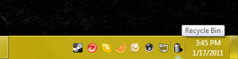
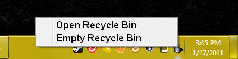
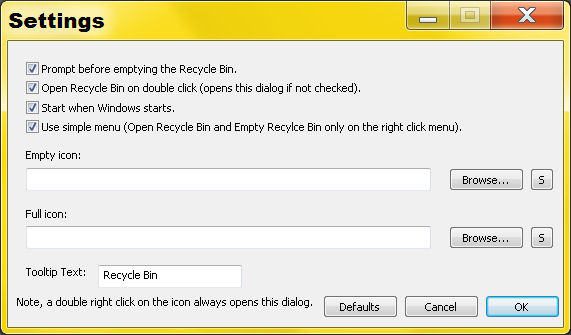

<link rel="stylesheet" href="site.css" />

# CornerBin - The System Tray Recycle Bin

<table>
<tr><td>Author:</td><td>Blaine Myers</td></tr>
<tr><td>Company:</td><td><a href="https://www.beemsoft.com">Beem Media</a></td></tr>
<tr><td>Original Release:</td><td>January 15, 2011</td></tr>
<tr><td>Licence:</td><td>MIT</td></tr>
<tr><td>Website:</td><td><a href="https://beemfx.github.io/CornerBin">https://beemfx.github.io/CornerBin</a></td></tr>
<tr><td>Source:</td><td><a href="https://github.com/beemfx/CornerBin">https://github.com/beemfx/CornerBin</a></td></tr>
<tr><td>Latest Release:</td><td><a href="https://github.com/beemfx/CornerBin/releases/download/v1.0.0.2/cornerbin-installer.exe">Version 1.0.0.2</a></td></tr>
</table>

### [Download Version 1.0.0.2](https://github.com/beemfx/CornerBin/releases/download/v1.0.0.2/cornerbin-installer.exe)

### Purpose
CornerBin adds an icon to the system tray with the same functionality as the Recycle Bin icon found on the Microsoft Windows desktop. This is especially useful for users that want access to the Recycle Bin without having to minimize their workspace on the desktop to have access to those features.

### Usage
Running the executable  will add an icon to the system tray. (The part of the Windows taskbar that contains the icon for network connectivity, volume control, etc).

#### Right Click Icon
Right clicking on that icon brings up a context menu with the following options:
* Open Recycle Bin - Opens the Recycle Bin folder in a new window.
* Empty Recycle Bin - Empties the contents of the Recycle Bin.
* Settings... - Opens a settings dialog box which allows the user to change various options.
* Quit - Terminates the CornerBin application.

#### Double Click Icon
The user may double click the icon with the primary mouse button. This opens
the Recycle Bin folder in a new window. (The same effect as selecting Open
Recycle Bin from the context menu.)

#### Shift Double Click Icon
Holding shift while double clicking the icon will open the settings dialog.

### Settings

CornerBin has some customization options available in the Settings Dialog. All settings are per-user, so changing settings while logged into one Windows user account will not affect another account's experience.

#### Prompt before emptying the Recycle Bin
When checked,the user will be asked if they are sure they want to empty the
Recycle Bin before it's contents are permanently deleted.

#### Open Recycle Bin on double click
When checked, double clicking the icon with the left mouse button opens the
folder for the Recycle Bin. When not checked, double clicking the icon opens
the settings dialog box.

#### Start when Windows starts
When checked, CornerBin will start whenever the user logs on. Note that this
is a per user setting. If one user has this option checked, CornerBin will
start whenever the user logs on, but it will not affect the usage of this
application on another user account. (This is especially useful because one
user may wish to use CornerBin, while another one wants their desktop free
of icons.)

#### Use simple menu
When this option is checked, the context menu that appears when right clicking
the icon will display only the "Open Recycle Bin" and "Empty Recycle Bin" options.
This is beneficial once you are satisfied with your chosen settings. With this
option selected and the start when windows starts option selected, CornerBin will
basically act like the original Windows Recycle Bin, except that it is much
smaller and out of the way.

Holding shift while double clicking on the icon will open the options dialog.

#### Empty icon
The user may browse their computer and select any icon that they would like to appear
in the system tray when the Recycle Bin is empty. The button with the 'S' label next
to the browse button will set the icon to the system icon for the Recycle
Bin. If the text field is blank, a default icon will be used.

#### Full icon
This works the same as the Empty icon filename.

#### Tooltip Text
This text can be whatever message the user would like to appear when the mouse hovers
over the CornerBin icon. By default it is "Recycle Bin", but if a user prefers it to
use the text "Trash Bin" they could so change it. Or change it to whatever they want.

### Additional Information
This application is open source, so it may be modified, udpated, patched, or otherwise
developed. The main page for this open source product is listed above, any specific
inquiries may be address to <a href="http://www.beemsoft.com/home/index.php?content=contact">http://www.beemsoft.com/home/index.php?content=contact</a> but
there are no guarantees that they will be address.
</body>

### Version History
* 1.0.0.0 - Initial release.
* 1.0.0.1 - Fixed several spelling mistakes (namely the word Recycle being spelled "Reycle").
* 1.0.0.2 - Added open settings by holding shift option.
